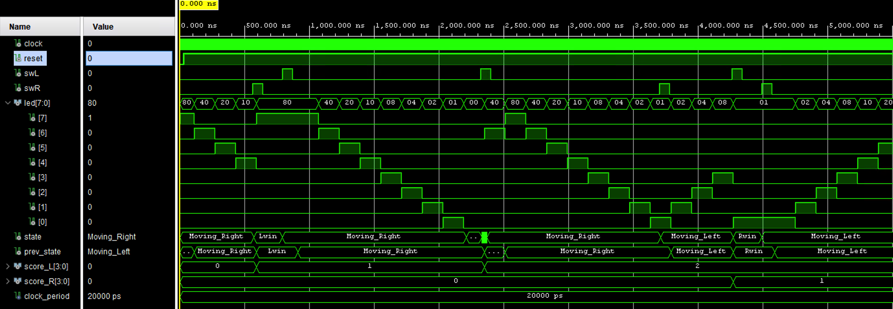
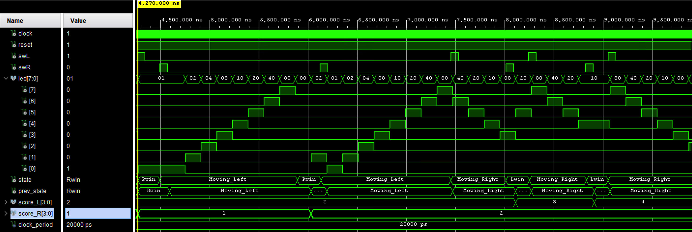
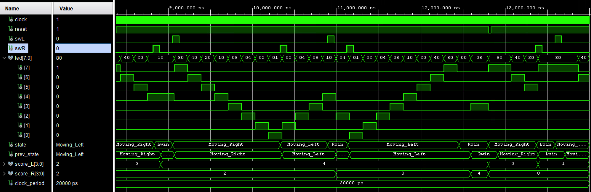
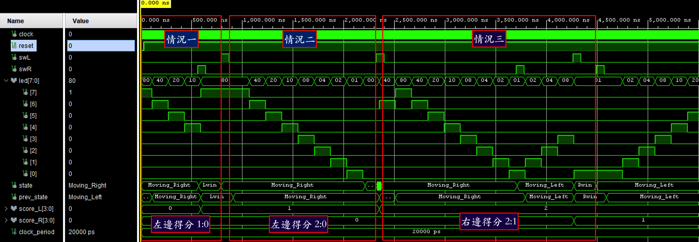
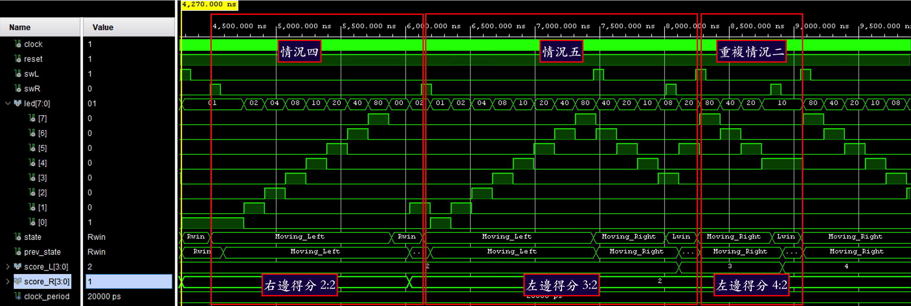
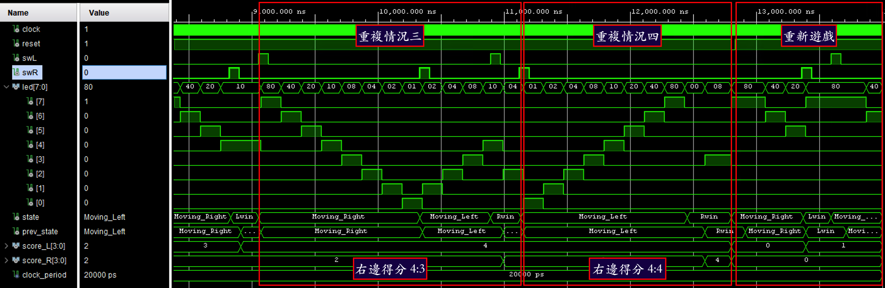

## HW3：PingPong Game (乒乓球遊戲設計)
利用FSM狀態機與LED移位邏輯設計，完成雙人互動式乒乓球遊戲。 
**HW3_PingPong.vhd** 中透過狀態機控制球（LED）的移動方向，並判斷玩家是否在正確的時機按下按鈕（擊球），若漏接則進行計分更新與狀態切換。

## 遊戲核心邏輯與計分機制
**(score_L 與 score_R 為雙方得分，顯示於七段顯示器或 LED)**

* **發球邏輯**：
    * 在 `Lwin` 狀態下，按下 `i_swL` (左方按鈕) 會進入 `Moving_Right` 狀態（左方發球）。
    * 在 `Rwin` 狀態下，按下 `i_swR` (右方按鈕) 會進入 `Moving_Left` 狀態（右方發球）。
* **擊球判定**：
    * 球移動至最右端 (`led_r(0) = '1'`) 時，若未即時按下 `i_swR`，則判定為左方獲勝 (`Lwin`)。
    * 球移動至最左端時，若未即時按下 `i_swL`，則判定為右方獲勝 (`Rwin`)。

## FSM 四種狀態（控制球速與勝負判定）
* **Moving_Right**：球向右方移動，偵測右方玩家擊球時機。
* **Moving_Left**：球向左方移動，偵測左方玩家擊球時機。
* **Lwin**：左方獲勝狀態。此時 `score_L` 加 1，並停止移動，等待左方按下按鈕重新發球。
* **Rwin**：右方獲勝狀態。此時 `score_R` 加 1，並停止移動，等待右方按下按鈕重新發球。

## 波形圖 (TESTBENCH 分析)

### 1. 完整波形 (Whole Waveform)
展示整體遊戲運行時的訊號連續變化，下方會有重點波形標記介紹：

### 2. 重點標記波形 (Situation Analysis)
針對特定遊戲狀況（如擊球、漏接、得分判定），詳細可以看**HW3_PingPong_tb.vhd**裡面的狀況設計。

* **狀況 1-3 分析：**
- 情況一：從左邊開始發球，右邊提前打（左邊得分）
- 情況二：從左邊開始發球，右邊漏接（左邊得分）
- 情況三：從左邊開始發球，右邊回擊，左邊提前回擊（右邊得分）

* **狀況 4-6 分析：**
- 情況四：從右邊開始發球，左邊漏接（右邊得分）
- 情況五：從右邊開始發球，左邊回擊，右邊提前回擊（左邊得分）
- 情況六：重複情況二邏輯，左邊發球，右邊提前打（左邊得分）

* **Reset 與其他狀況分析：**
- 情況七：重複情況三邏輯，左邊發球，右邊回擊，左邊提前回擊（右邊得分）
- 情況八：重複情況四邏輯，右邊發球，左邊漏接（右邊得分）
- 最後：重新開始遊戲

## 【加分題】動態變速機制
* 當雙方總分 $$score\_L + score\_R \ge 4$$ 時，系統會調整分頻計數器，使 LED 移動速度加快。
