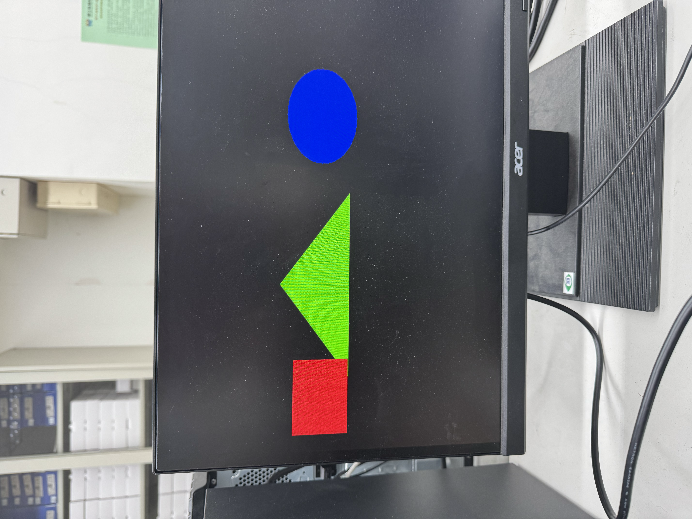

# HW4：VGA顯示圖案

本實驗利用 VHDL 產生的 VGA 時序訊號，在螢幕上實時計算並顯示三種基礎幾何圖形（正方形、三角形、圓形）。

## 1. VGA 顯示規格與時鐘分頻
* **時鐘分頻 (Clock Division)**：將 FPGA 板載的 100MHz 主時鐘，透過 2-bit 計數器分頻為 **25MHz (Pixel Clock)**，符合 640x480 @ 60Hz 的標準需求。
* **時序參數**：
    * **水平 (Horizontal)**：Sync 96, Back Porch 48, Active 640, Front Porch 16 (Total 800)。
    * **垂直 (Vertical)**：Sync 2, Back Porch 33, Active 480, Front Porch 10 (Total 525)。

## 2. 幾何圖形生成邏輯 (Geometry Logic)
程式碼透過偵測當前掃描線的座標 (`h_count`, `v_count`)，即時判斷並繪製圖形：

- **紅色正方形 (Square)**：
  - **邏輯**：判斷 X 與 Y 座標是否在定義的範圍矩形內。
  - **位置**：左側區域。
- **綠色三角形 (Triangle)**：
  - **邏輯**：利用 `abs(h_count - center)` 的絕對值與垂直高度的比例關係，模擬出等腰三角形的斜率。
  - **位置**：螢幕中央。
- **藍色圓形 (Circle)**：
  - **邏輯**：實作圓形方程式 $$(x-x_0)^2 + (y-y_0)^2 \le r^2$$。透過計算像素與圓心的距離平方來決定填色範圍。
  - **位置**：右側區域。

## 3. 系統架構
1. **計數器模組**：產生連續的水平與垂直掃描位址。
2. **同步訊號產生**：根據計數器數值產生 `h_sync` 與 `v_sync`。
3. **顏色輸出邏輯**：在 Active Video 區域內，根據幾何公式輸出對應的 RGB 訊號，其餘區域（Porch 與 Sync）強制輸出為黑色。

## 4.實體顯示畫面｜DEMO影片：[點選我](https://www.youtube.com/watch?v=EoGQBPZlMa0)
螢幕從左至右分別顯示紅色正方形、綠色三角形、藍色圓形。
---

